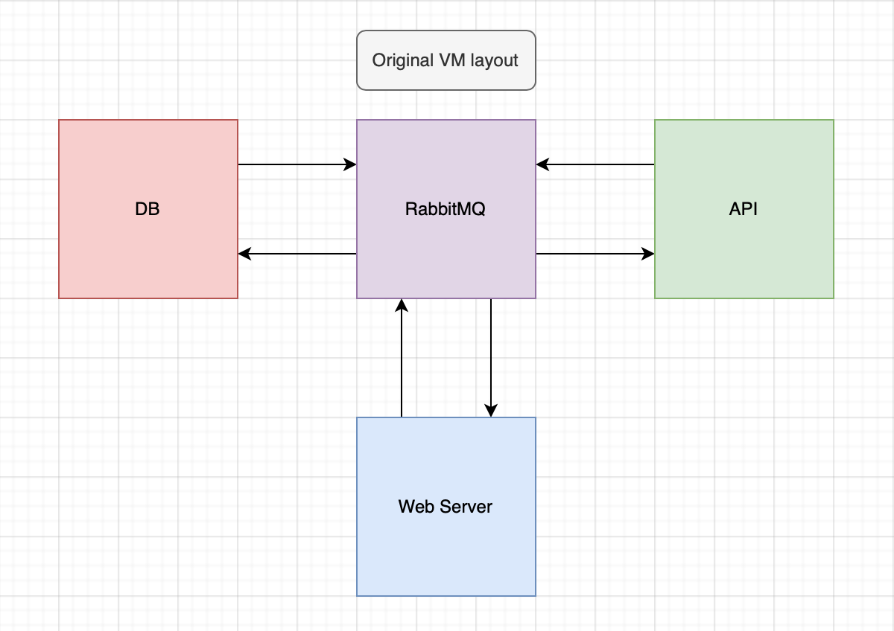
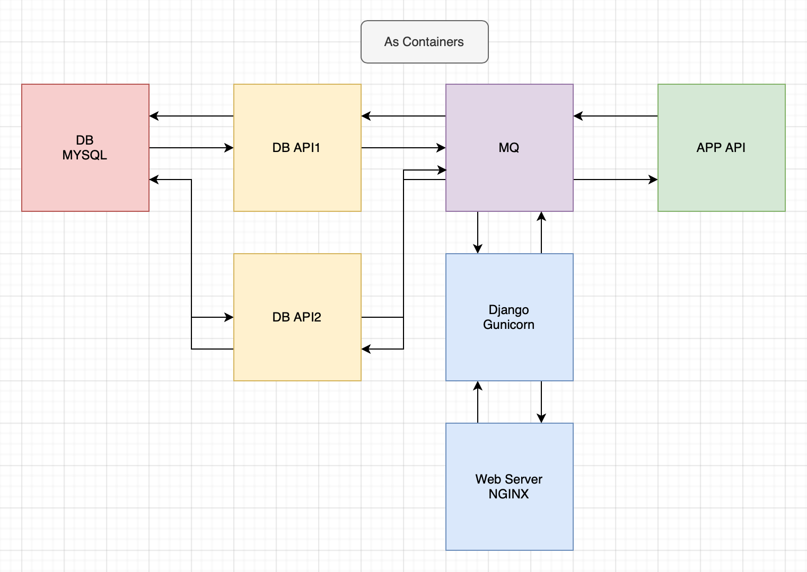
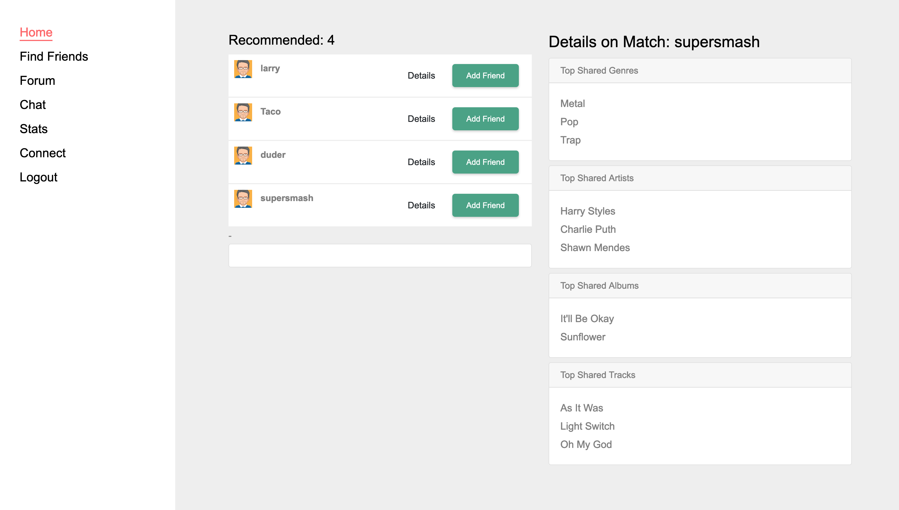
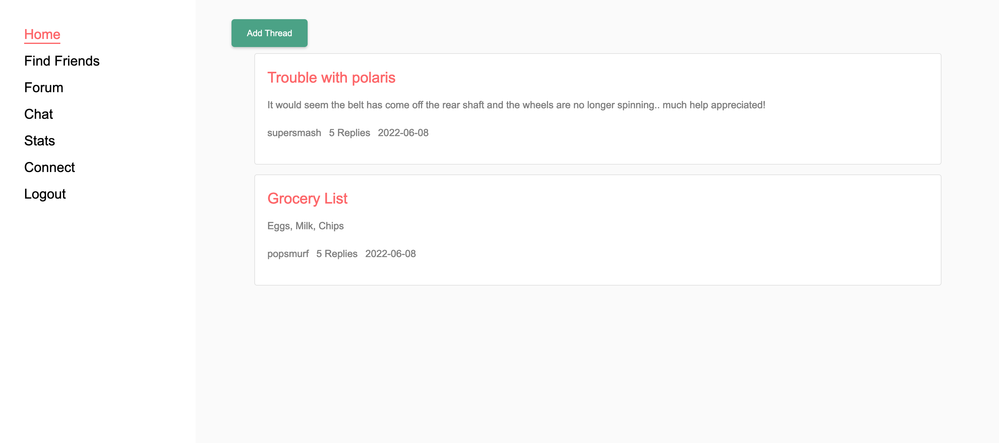
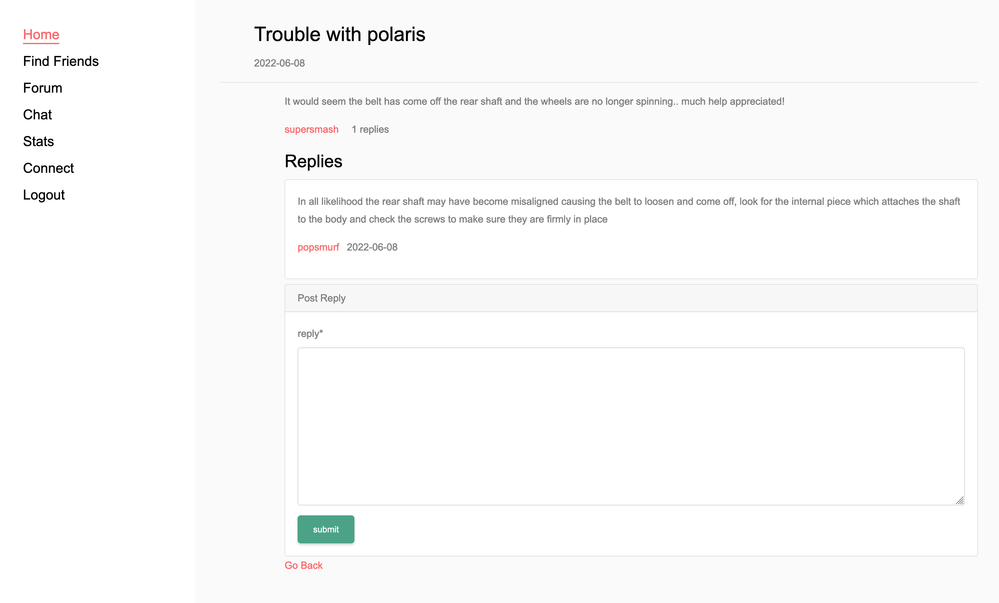
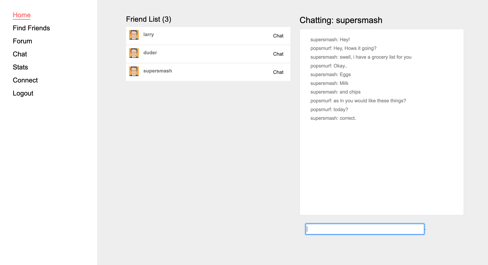
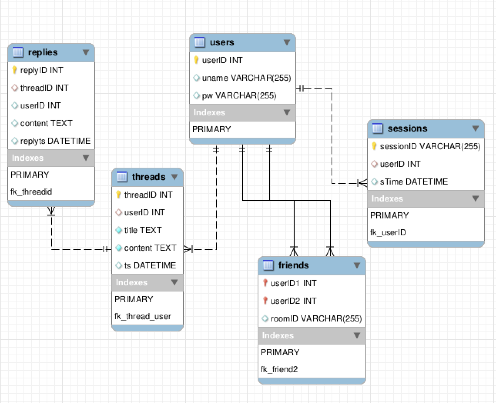
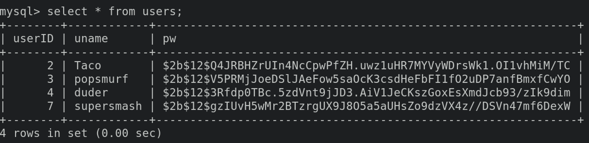

# Social App Demo 

### Concept
To create a conduit for various social features to be implemented around spotify using their api, with the idea of recommending potential friends to users based on mutually shared music interests and listening habits. This took the form of a web application with the following user features:

* Login
* Friends list
* Chat
* Forums
* Friend recommendation system
* Music statistic viewer

Some of the more technical aspects include:

* Sessions
* Password hashing + salting
* MySQL database
* RabbitMQ (all communication) 
* Nginx
* Django
* WSGI
* Docker (for this version)

### Design

The [code for the original project](https://github.com/jaredmyers/rabbitMQ_proj) was implemented using VMs and had a design looking like:

Here, this layout has been expanded and redesigned for the use of containers:

The original project was also expanded into Dev, QA, and Prod networks with a custom rudimentary deployment server created to track packages across the networks. [This can be found here](https://github.com/jaredmyers/lasthalf_bak), with a [design write up on the package management system here.](https://drive.google.com/file/d/1991pcHl1mj3k-vEqHJIoMChZXfco0spY/view?usp=sharing)

### Frontend

#### Login Page
----

#### Recommended Friends Page
----

#### Forum Page
----

#### Forum Replies
----

#### Chat Page
----

#### Stats and Connect pages

**Stats**: served to deliver the users music listening statistics

**Connect**: served to authenticate and grab an API token from spoitify

The api was hallowed out for this demo (only serving preconfigured json) and these pages are not implemented.

### Database
----

View [socialApp.sql here](htts://github.com/jaredmyers/social_app/blob/master/db/socialApp.sql)

A new table is dynamically created when a user initiates a chat. This table stores all chat messages and can be destroyed upon unfriending the chat recipient.

Salting and hash with bcrypt:

### RabbitMQ
----

All interprocess communcation goes through the MQ, with RPC requests being used where synchronicity is essential.

Three main queues are used, 1 for Spotify API requests and 2 for DB requests. A fanout queue is also optional for potential logs.

